# swe-day

A skill that has a coding agent run one bounded unit of
software work end to end, stopping at a human gate wherever
judgment decides the next move. It ships two small programs:
a single-writer lock and a next-action banner.

swe_day_lock.py refuses to acquire a lock that is held.

<picture>
  <source
    media="(prefers-reduced-motion: reduce)"
    srcset="assets/poster.svg"
  />
  
</picture>

The demo is reconstructed from
[`evidence/transcripts/lock-session.txt`](evidence/transcripts/lock-session.txt),
a captured run of the two programs in a throwaway
repository.

**Not measured, stated up front.**

- No agent ran a SWE day to produce the evidence here. The
  transcript shows only the lock and the banner.
- Whether an agent that follows `SKILL.md` actually stops at
  each human gate has not been measured.
- Neither Claude Code nor Codex was started to confirm that
  the invocation names below resolve.

## What is in it

- [`skills/swe-day/SKILL.md`](skills/swe-day/SKILL.md) is
  the spec: the signature, the inputs a wrapper binds, the
  stateful invocation contract, phase roles, operating
  discipline, and Active Run mode.
- [`skills/swe-day/references/steps.md`](skills/swe-day/references/steps.md)
  is the steps, numbered 0 to 17, each tagged with its owner
  and, where it has one, its blocking gate.
- [`skills/swe-day/references/summary.md`](skills/swe-day/references/summary.md)
  is a short summary for a human reader.
- [`skills/swe-day/scripts/swe_day_lock.py`](skills/swe-day/scripts/swe_day_lock.py)
  manages the lock: `acquire`, `status`, `set-phase`,
  `clear-gate` and `release`.
- [`skills/swe-day/scripts/swe_day_next.py`](skills/swe-day/scripts/swe_day_next.py)
  renders the next-action banner from the lock.

## Not included

The skill is a conductor. It sequences other skills and
protocols that a per-repository wrapper must bind, and none
of them ships here: a bounded fix loop, a result visualizer,
a multi-persona code review, an operator-comment ingest, a
review watcher, a coverage improver, a mutation-testing
audit, a handoff recorder, and a commit planner. Step 0 of
the skill checks the first eight and fails loudly when one
does not resolve.

The steps call four of them by name: `improve-coverage`,
`review-watch`, `address-comments` and `planCommits()`.
Those are the names the skill was written against, not
things you can install from here; a wrapper binds its own.

## Use it

Read [`skills/swe-day/SKILL.md`](skills/swe-day/SKILL.md)
before you install it. The file is an instruction set that
steers an agent, so both installs below are pinned to a tag
rather than to `main`.

### Claude Code

Save this as `install.sh` and run it with `sh install.sh`.
It sets `set -eu` and an `EXIT` trap, so pasting it straight
into an interactive shell will end that shell if the clone
fails.

```sh
set -eu
release=v0.1.0
install_target="$HOME/.claude/skills/swe-day"
install_parent="$(dirname "$install_target")"
mkdir -p "$install_parent"
install_tmp="$(mktemp -d "$install_parent/.swe-day.XXXXXX")"
install_stage="$install_tmp/package"
rollback_install() {
  if [ ! -e "$install_target" ]; then
    if [ -e "$install_tmp/previous" ]; then
      mv "$install_tmp/previous" "$install_target"
    fi
  fi
  rm -rf "$install_tmp"
}
trap rollback_install EXIT
git clone --quiet --depth 1 --branch "$release" \
  https://github.com/trycopilotai/swe-day \
  "$install_tmp/clone"
mkdir -p "$install_stage"
cp -R "$install_tmp/clone/skill/." "$install_stage/"
if [ -e "$install_target" ]; then
  mv "$install_target" "$install_tmp/previous"
fi
mv "$install_stage" "$install_target"
trap - EXIT
rm -rf "$install_tmp"
```

Invoke it as `/swe-day`.

### Codex

Save this one the same way. The only line that differs from
the block above is `install_target`.

```sh
set -eu
release=v0.1.0
install_target="$HOME/.agents/skills/swe-day"
install_parent="$(dirname "$install_target")"
mkdir -p "$install_parent"
install_tmp="$(mktemp -d "$install_parent/.swe-day.XXXXXX")"
install_stage="$install_tmp/package"
rollback_install() {
  if [ ! -e "$install_target" ]; then
    if [ -e "$install_tmp/previous" ]; then
      mv "$install_tmp/previous" "$install_target"
    fi
  fi
  rm -rf "$install_tmp"
}
trap rollback_install EXIT
git clone --quiet --depth 1 --branch "$release" \
  https://github.com/trycopilotai/swe-day \
  "$install_tmp/clone"
mkdir -p "$install_stage"
cp -R "$install_tmp/clone/skill/." "$install_stage/"
if [ -e "$install_target" ]; then
  mv "$install_target" "$install_tmp/previous"
fi
mv "$install_stage" "$install_target"
trap - EXIT
rm -rf "$install_tmp"
```

Invoke it as `$swe-day`.

Each block works in a temporary `.swe-day.*` directory
beside the target and removes it on exit. An existing
install at the target is replaced.

While it clones, `git` warns that the tag "is not a commit"
and notes a detached `HEAD`. Both are expected for a clone
pinned to an annotated tag.

Both blocks copy through `skill/`, a symlink to
`skills/swe-day/`, so the installed directory holds
`SKILL.md`, `agents/`, `references/` and `scripts/` as real
files. The repository also carries
`.claude-plugin/plugin.json` and `.codex-plugin/plugin.json`
for a marketplace. No marketplace lists this skill, so no
marketplace install is described here.

## Evidence

`evidence/transcripts/lock-session.txt` is the captured run
behind the claim at the top of this file.
`scripts/record_session.py` wrote each `$` line and each
exit status; the rest is the two programs' output, with two
edits: the throwaway directory's path was replaced with
`/work`, and the recording machine's hostname with `host`.
The transcript itself carries no notice of that.
`evidence/demo-manifest.json` is where the edits are
declared, as `replace-capture-root` and `replace-hostname`,
beside the SHA-256 of both programs and of `SKILL.md`, the
commands, the interpreter, the date, and the SHA-256 of the
transcript.

`make check` runs the programs' own tests and a packaging
contract that ties this file, both plugin manifests, the
transcript and the demo images to each other.

## Contributing

See [`CONTRIBUTING.md`](CONTRIBUTING.md).

## Security

See [`SECURITY.md`](SECURITY.md).

## License

MIT. See [`LICENSE`](LICENSE).

## Not affiliated with GitHub or GitHub Copilot

The `trycopilotai` organisation name is not a claim of any
relationship with GitHub Copilot. This project is not
affiliated with, endorsed by, or sponsored by GitHub, Inc.
GitHub and GitHub Copilot are trademarks of GitHub, Inc.
